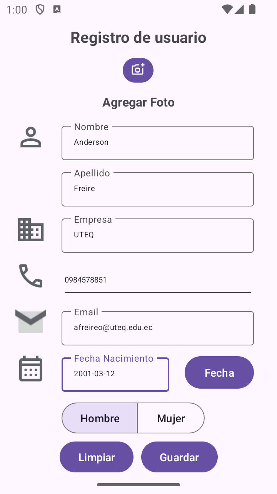

# INTERFAZ DE USUARIO (UI)
Desarrollo de una aplicacion móvil con el uso de los controles comunes de la interfazde usuario (UI) de android. se busca replicar un formulario de inscripción de usuarios 

## Formulario de inscripción

## Formulario de muestra de datos

## Uso de scrollview
https://github.com/afreireo/semana3_ui/assets/86501595/5250d163-da88-4aae-baa1-29239466b7cf

## Funcionamiento de la aplicación
https://github.com/afreireo/semana3_ui/assets/86501595/6c465eed-cdd8-47a6-9c34-32c29a9413d9

